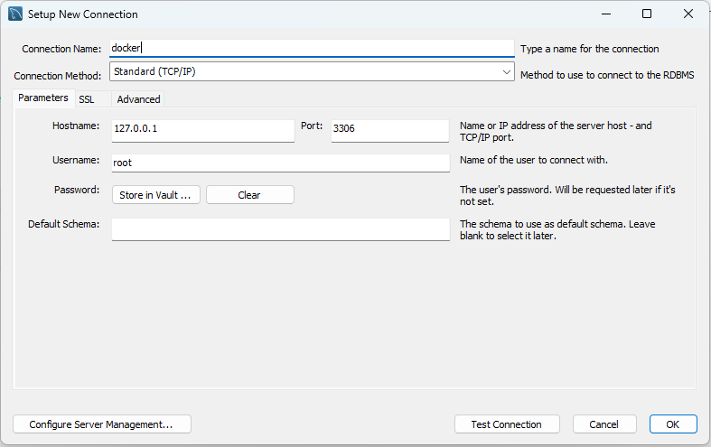
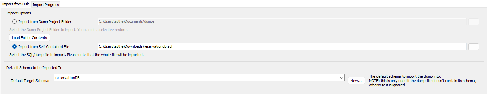

# CS312-MidtermProject-Leonardos
Welcome to the `Leonardos Project`, a web application for online reservations created specifically for Saint Louis University (SLU). This application hosts products for reservation by various SLU organizations allowing users to quickly book products and lower booth traffic during events.

## Prerequisites
Before setting up the application, the following tools should be installed on your system:
1. Docker
2. MySQL Workbench

## Get Started
The following steps will guide you through running the web application.

### 1. Clone the Repository
Clone the project repository from the GitHub link:
```
# Clone the repository using the following command:
git clone https://github.com/Stephen-Coloma/CS312-MidtermProject-Leonardos
```

### 2. Setting Up Docker Images
Navigate to the base folder of the repository and build the Docker images using the `compose.yaml` file:
```
# Ensure you are in the ./CS312-MidtermProject-Leonardos directory.
docker compose build
```

### 3. Running the Docker Containers
After building the images, create and run the containers using the command below:
```
docker compose up
```

### 4. Importing the MySQL Database
Since the Docker containers start with an empty database, import the necessary data into the database:
1. Open `MySQL Workbench` and create a new connection (no password required).
    
2. Access the connection and import the MySQL file located at `./admin/src/database/reservationdb.sql`.
3. Use the database name `reservationDB` during the import.
    

## Accessing the Web Application
### Vendor Side
To access the vendor side of the application:
* If the containers are running on the same machine, open the following URL in your browser:
```
http://localhost:80
```
* If the containers are running on another machine, use the server's IP address (ensure your device is connected to the same network):
```
http://192.168.xxx.xxx:80
```

### Customer Side
To access the customer side of the application:
* If the containers are running on the same machine, open the following URL in your browser:
```
http://localhost:3000
```
* If the container are running on another machine, use the server's IP address (ensure your device is connected to the same network):
```
http://192.168.xxx.xxx:3000
```

## Project Contributors:
This project is a collaborate effort by the following contributors:
1. COLOMA, Stephen M.
2. GUZMAN, Sanchie Earl M.
3. LEUNG, Leonhard T.
4. NONATO, Marius Glenn M.
5. RAGUDOS, Hannah T.
6. RAMOS, Jerwin Kyle R.
